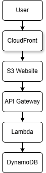
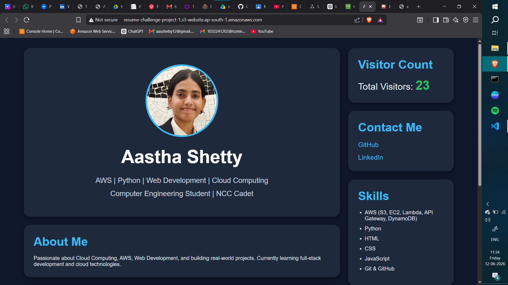
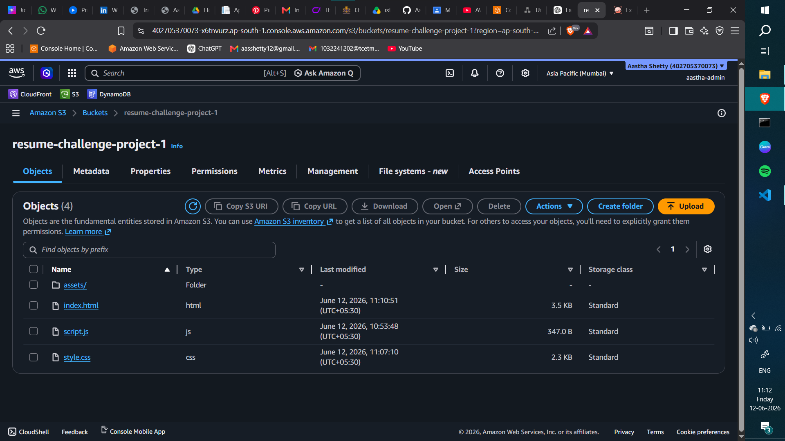
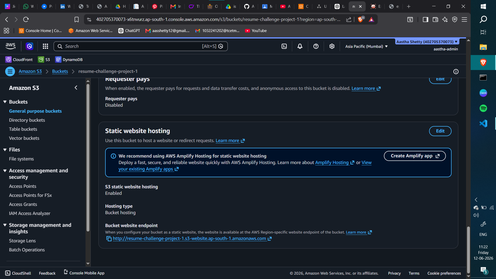
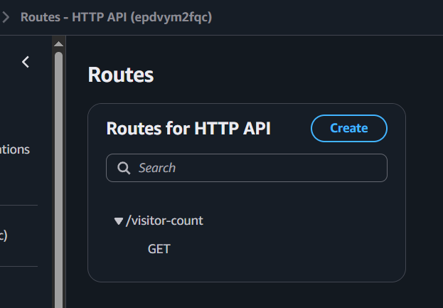
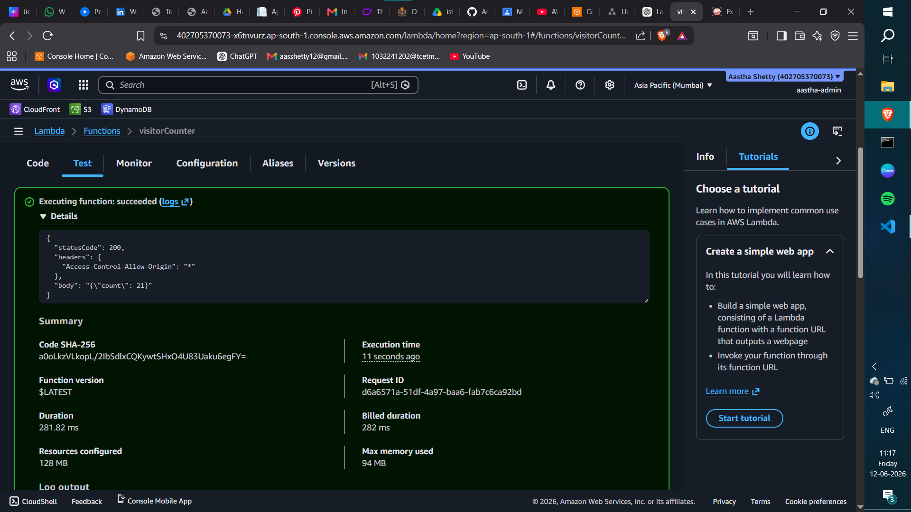
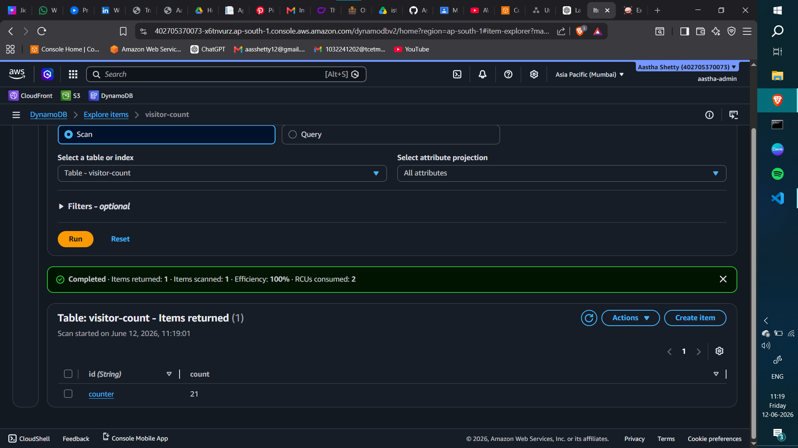
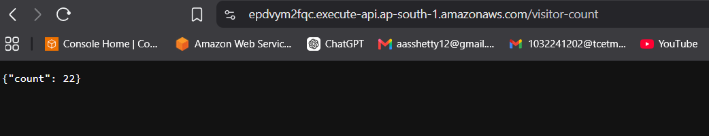

# ☁️ Cloud Resume Challenge (Serverless AWS Project)


A fully serverless resume web application built using AWS services with a real-time visitor counter powered by a backend API.

This project demonstrates **serverless architecture, REST APIs, and cloud integration**.

---

# 🚀 Architecture

```text id="u7xkq1"
User Browser
     ↓
S3 Static Website Hosting
     ↓
JavaScript Fetch API
     ↓
API Gateway
     ↓
AWS Lambda
     ↓
DynamoDB
```


---

# 🌐 Features

* ⚡ Fully serverless backend (no servers to manage)
* 📊 Live visitor counter (updates on every visit)
* 🔗 REST API integration with frontend
* 🧠 Backend logic using AWS Lambda
* 🗄️ Scalable NoSQL database (DynamoDB)
* ☁️ Static website hosting using S3

---

# 🧰 AWS Services Used

* Amazon Web Services — Cloud infrastructure
* Amazon S3 — Static website hosting
* Amazon API Gateway — REST API management
* AWS Lambda — Backend logic execution
* Amazon DynamoDB — Visitor counter database
* AWS Identity and Access Management — Permissions & security

---

# 📁 Project Structure

```text id="9x0p2m"
cloud-resume-challenge/
│
├── index.html
├── style.css
├── script.js
└── /screenshots
    ├── home-page.png
    ├── counter-working.png
    ├── dynamodb-table.png
    ├── lambda-function.png
    └── api-gateway.png
```

---

# ⚙️ How It Works

## 1. Frontend (S3 Hosting)

The resume website is hosted using AWS S3 static website hosting.

---

## 2. API Call (Frontend → Backend)

```javascript id="gk2n4x"
fetch("YOUR_API_URL")
  .then(res => res.json())
  .then(data => {
    document.getElementById("visitor-count").innerText = data.count;
  });
```

---

## 3. Backend Flow

* API Gateway receives request
* Triggers AWS Lambda function
* Lambda reads & updates DynamoDB counter
* Returns updated visitor count

---

# 📊 Example API Response

```json id="8c0x7k"
{
  "count": 245
}
```

## 🎥 Project Demo

A short walkthrough of the working website and visitor counter system.


---

# 📸 Screenshots

## 🖥️ Website UI (Final Portfolio Website)



## 📊 S3 Bucket Files



## 🗄️ S3 Static Website Hosting Enabled



## ⚙️ API Gateway Route



## 🌐 Lambda Function Code


## 🌐 Lambda Test Success Output



## 🌐 DynamoDB Table (Counter Item)



## 🌐 API Endpoint Working (Browser Response)



---

# 🧠 Key Learnings

* Serverless architecture using AWS Lambda
* REST API development using API Gateway
* NoSQL database design using DynamoDB
* Static website hosting using S3
* End-to-end cloud application flow
* IAM roles and permissions

---

# 💡 Resume Summary

Built a serverless resume web application using AWS S3, API Gateway, Lambda, and DynamoDB. Implemented a real-time visitor tracking system using REST APIs and NoSQL database integration, demonstrating cloud architecture and backend development skills.

---

# 🚀 Future Improvements

* Add custom domain using Route 53
* Add CI/CD pipeline using GitHub Actions
* Improve UI/UX design
* Add analytics dashboard
* Add HTTPS with domain hosting

---

# 👩‍💻 Author

**Astha Shetty**
GitHub: [Astha-S12](https://github.com/Astha-S12)

---
